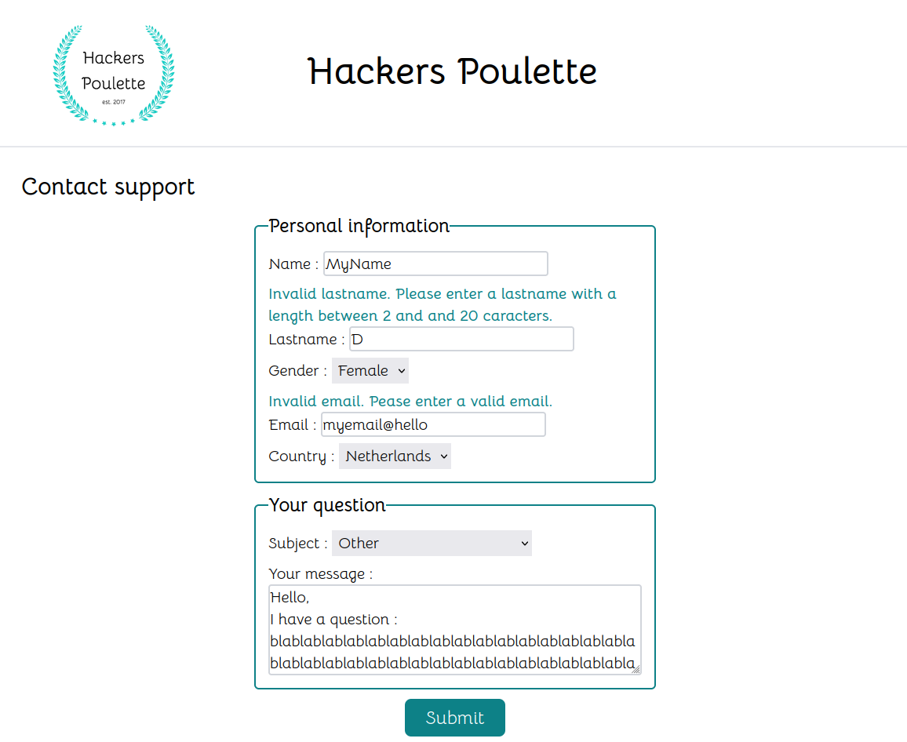

# hackers-poulette
Becode project :  create a fully-functioning online "contact support" form in PHP.

## Briefing
[Instructions](https://github.com/becodeorg/CRL-KELLER-6/tree/main/1.TRAIL/2.The-Hill/2.PHP/Hackers_Poulette) for the exercise.
The company Hackers Poulette ™ sells Raspberry Pi accessory kits to build your own. They want to allow their users to contact their support team. Your mission is to create a fully-functioning online "contact support" form, in PHP. It must display a contact form and process the received answer (sanitize, validate, answer the user).
NOTE: All field, except subject, have to be completed. The field subject takes a default value of Other.

The form should be comprised of:

* name and lastname
* gender
* email address
* country
* subject (3 possibilities)
* message

Must have:

* the project repository must include a low-fidelity mock-up
* the form's html code must be semantically valid
* the HTML must be accessible to blind people
* in case of wrong input, the form should display a useful visual clue about the error
* display the error message near the correct input field
* the error message must be readable (helpful to users)
* the form has to be sanitised and validated (server side)
* if all required inputs are valid, the script should respond by email to a given address   
* implement a honeypot anti spam technique.

## Printscreen

## Used languages
HTML, Tailwind, PHP, phpmailer

## Authors
Virginie Dourson

## Date
11/2023

## Duration
2 days

## Progression
Finished

## Github page
Not deployed
